## installing & configuring ansible on ec2 instance

i'm using the jenkins server i configured in the previous project for this ansible project 

`$ sudo apt update`

`$ sudo apt install ansible`

`$ ansible --version`

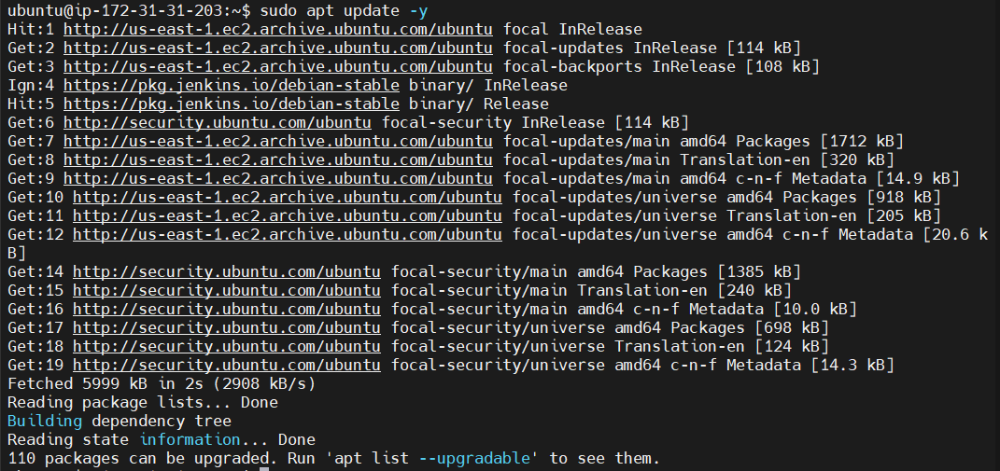

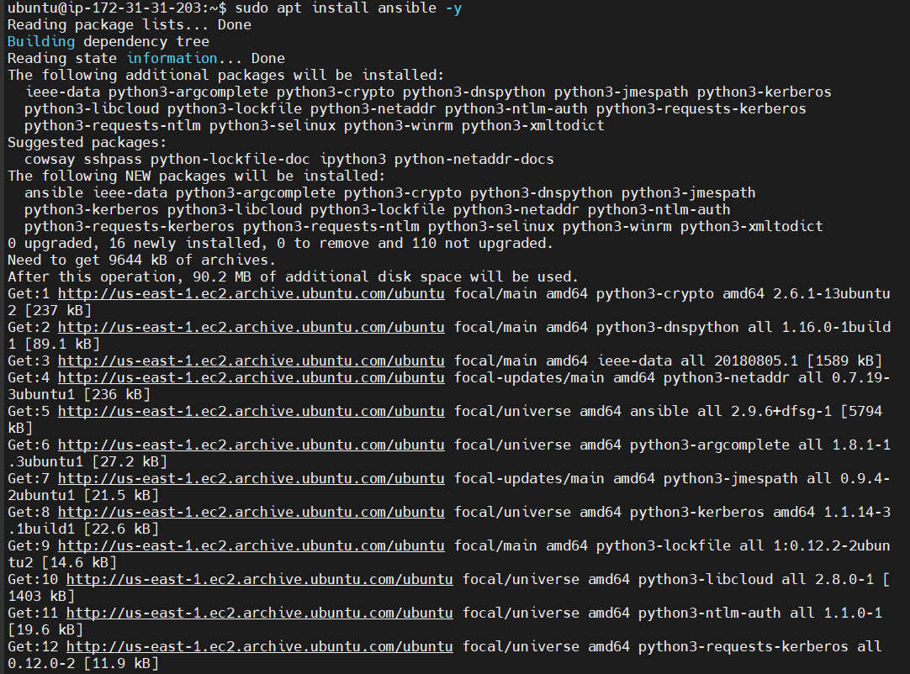

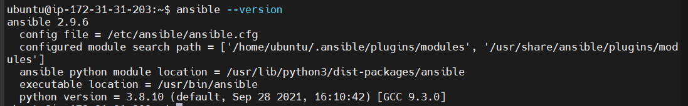

creating github repo, ansible-config-mgt, for the project

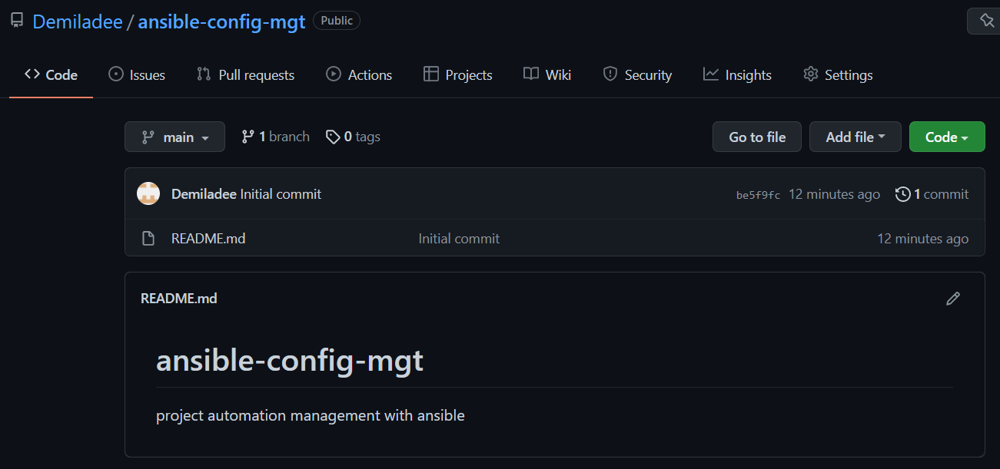

creating jenkins job - freestyle project - and pointing it to the ansible repo

configuring webhook to trigger ansible build

configuring post-build job to save all files

testing config by editing readme file

confirming jenkins saves the file in remote folder

`$ ls/var/lib/jenkins/jobs/ansible/builds/build-number/archive/`

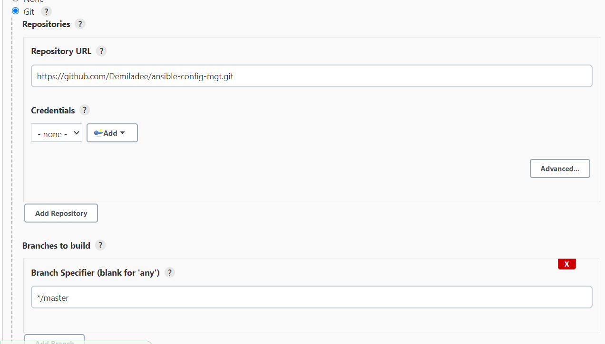

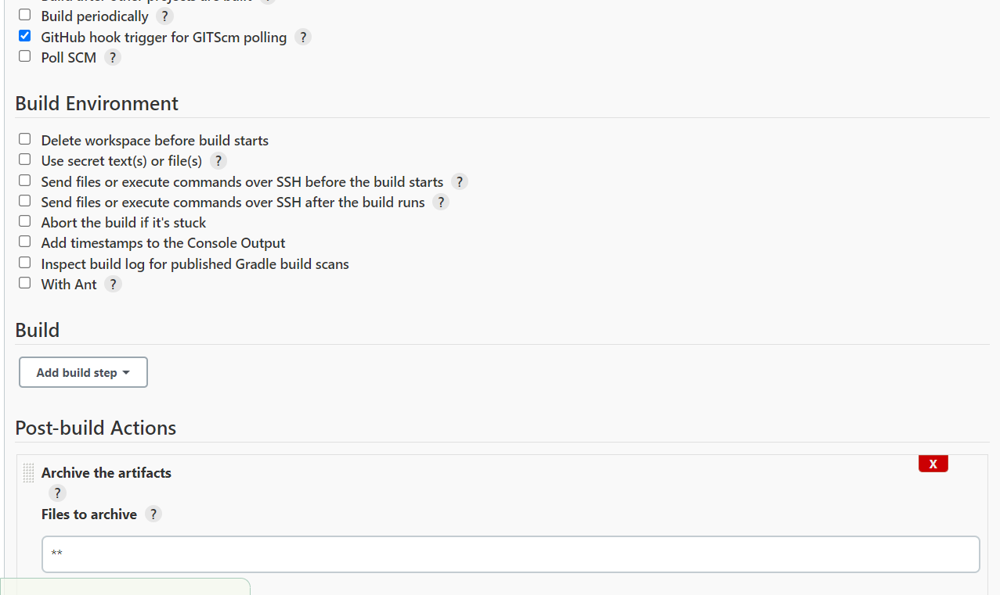

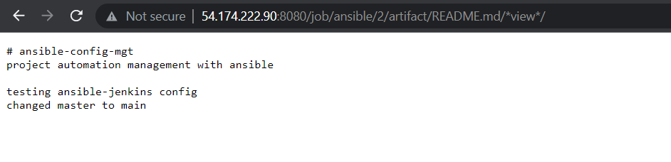

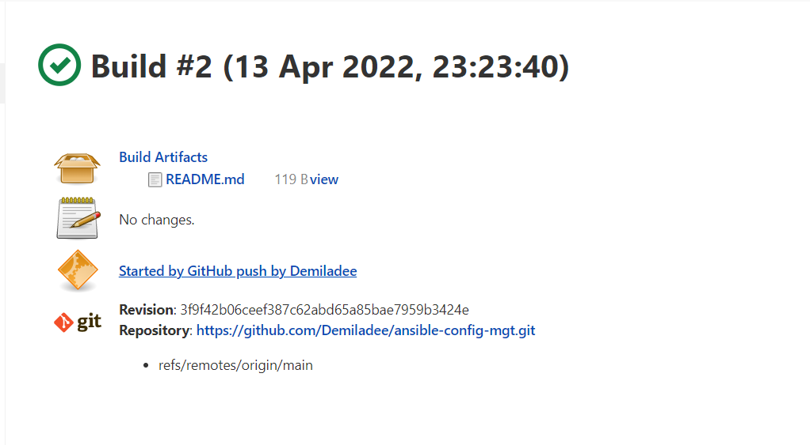

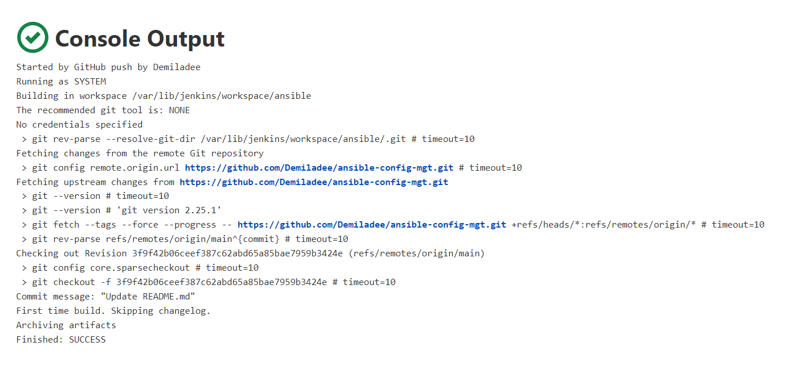

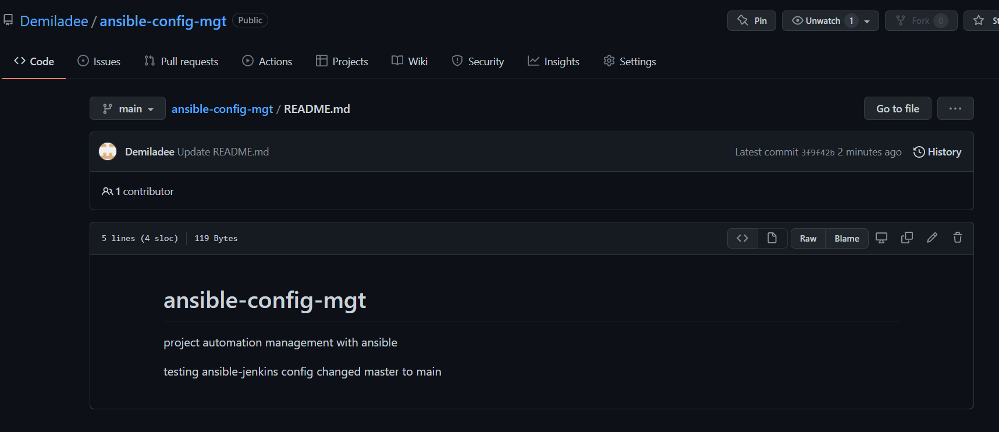

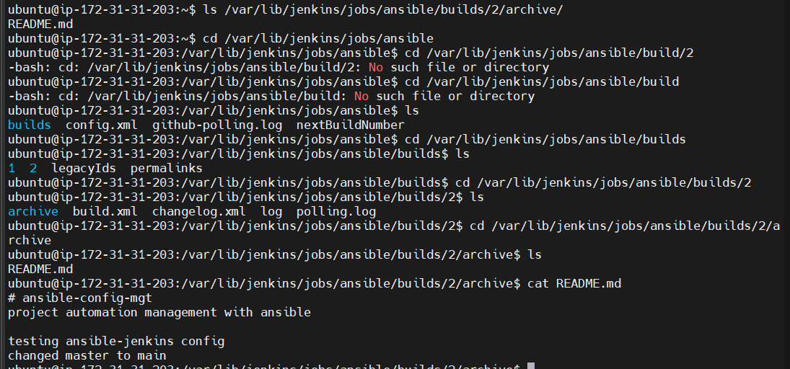

setup should look like this now:

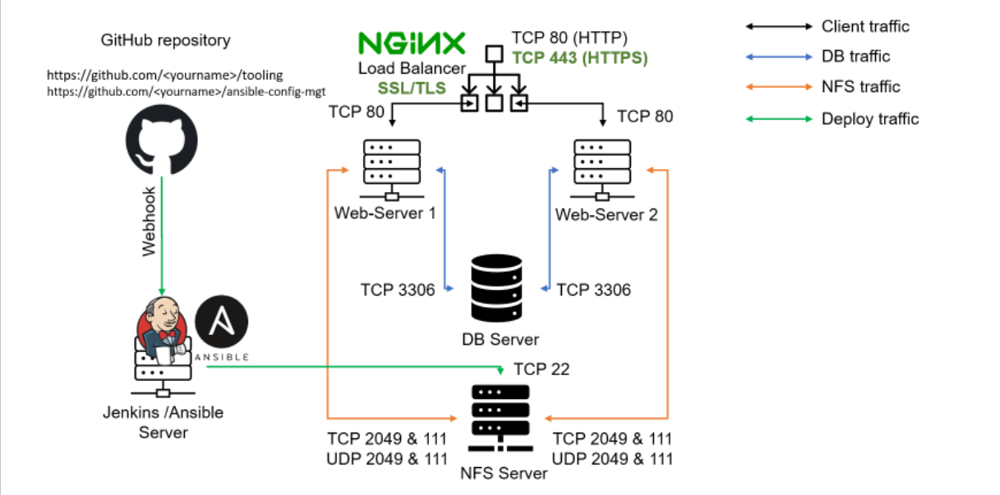